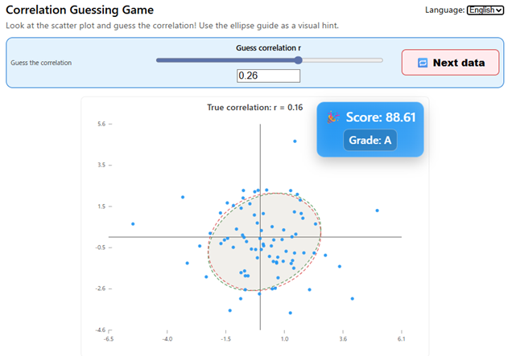

# 📘 相関係数 推測ゲーム

### *Correlation Coefficient Guessing Game*

---

## 日本語版
#### [English](#english-version) | [日本語](#日本語版)


## 🎮 相関係数を見た目だけで当てよう！

この Web アプリは、**散布図の形から相関係数を推測するゲーム**です。

* 推測した相関係数に応じて **楕円ガイド** が変化
* 採点後に真の相関係数と対応する楕円を表示
* 推測精度に応じて点数が決まり、S を取ると連勝カップが増える
* データの分布は毎回ランダム生成

---

## デモ

* [プログラムの使用例(Webアプリ)](https://tanaken-basis.github.io/corr-guess-game/) で実際の挙動を確かめることができますのでご覧ください。

## 📌 主な機能

### 🔹 散布図のリアルタイム描画

* 毎回ランダムに生成される 2 変量正規風データ（位置・ばらつきも毎回変わる）

### 🔹 相関係数 r の推測

* 上部バーの中央のスライダーで値を設定
* 数値入力ボックスで直接入力も可能
* 小数点以下の桁数（1〜4）は設定パネルで変更可能

### 🔹 楕円ガイド

* 共分散行列
  $$
  \Sigma =
  \begin{pmatrix}
  \sigma_x^2 & \rho\sigma_x\sigma_y \\
  \rho\sigma_x\sigma_y & \sigma_y^2
  \end{pmatrix}
  $$
  の等高線を元にした楕円

### 🔹 採点機能 & 演出

* 推測値と真値の差に基づいて点数を計算
* S / A / B / C / F の5段階評価

### 🔹 連勝カップコレクション

* S を取る度に 🏆 が増えていく
* 8 個以上は「🏆×8 +{more}」のように集約表示
* S 以外を取ると連勝数リセット

---

## 🚀 インストール & 実行

```sh
git clone https://github.com/tanaken-basis/corr-guess-game.git
cd corr-guess-game
npm install
npm run dev
```

ブラウザで
`http://localhost:5173/`
にアクセス。

---

## English Version
#### [English](#english-version) | [日本語](#日本語版)



# 🎮 Correlation Coefficient Guessing Game

This web app is a **visual correlation estimation game**.
You observe a scatter plot and try to guess the correlation coefficient **r**.

* Score evaluation
* S–F grading
* Trophy streak system
* Optional ellipse hint using mathematically correct covariance ellipses

---

## Demo

* Check out the [example of program usage](https://tanaken-basis.github.io/corr-guess-game/) to see how it works.

## 🌟 Features

### 🔹 Real-time scatter plot

* Generated from a random “pseudo 2D normal-like” distribution each time
* Position, scale, and correlation vary every round

### 🔹 Guessing r (your estimated correlation)

* Centered slider in the top bar
* Numeric input available
* Decimal digits (1–4) adjustable in settings

### 🔹 Mathematical Hint Ellipse

* Based on the covariance matrix
* Ellipse changes dynamically with your guessed r
* True ellipse shown after evaluation

### 🔹 Score & Grading

* Based on the normalized difference between guessed r and true r
* Five grades: **S / A / B / C / F**
* Animated, colorful score overlay

### 🔹 Trophy Streak

* Earn a 🏆 for every S
* Streak grows until reset by a non-S grade
* Condensed display (e.g., “🏆🏆🏆… +4”)

## 🚀 Installation

```sh
git clone https://github.com/tanaken-basis/corr-guess-game.git
cd corr-guess-game
npm install
npm run dev
```

Open the browser at:

```
http://localhost:5173/
```
